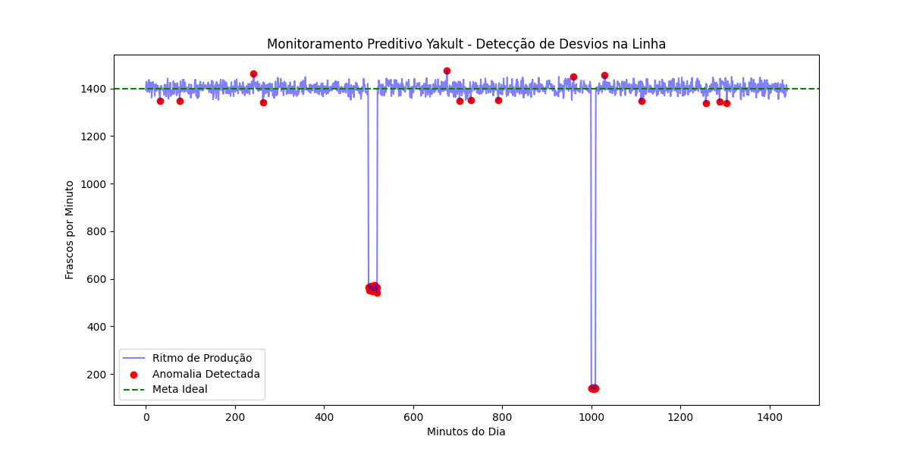
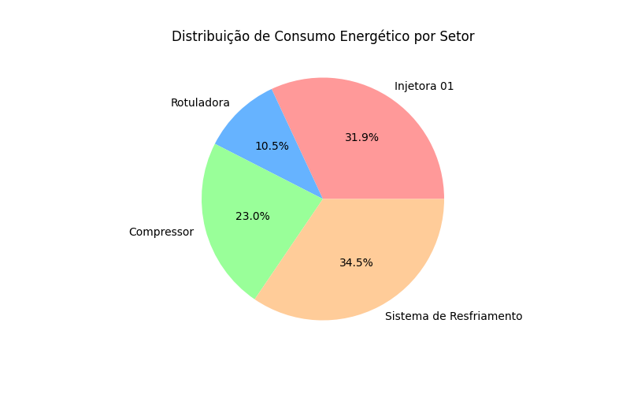

# 🏭 Engenharia de Dados & Inteligência Industrial (Vale do Paraíba)

Bem-vindo ao meu portfólio de tecnologia aplicada. Este repositório é o resultado de uma jornada de desenvolvimento focada em resolver desafios reais de indústrias de alta cadência na região de Lorena/SP (Especialmente setores como *Alimentício, Químico e Logístico*).

---

## 🚀 Destaques de Indústria 4.0

### 🤖 Monitoramento Preditivo & Detecção de Anomalias (Caso Yakult Lorena)
Sistema de IA treinado para monitorar linhas de produção com volume de $2 \times 10^6$ unidades/dia.
* *Algoritmo:* Isolation Forest para identificação de desvios rítmicos em tempo real.
* *Objetivo:* Prevenção de paradas não programadas (*Downtime*) e garantia da continuidade operacional.
* *Impacto:* Transformação de dados brutos de sensores em alertas críticos de manutenção.

### 📊 Gestão de Eficiência Global (OEE & Pareto)
Ferramenta de análise de performance industrial que quantifica a eficiência real da planta.
* *Métricas:* Disponibilidade, Performance e Qualidade.
* *Análise Financeira:* Conversão de minutos parados em impacto monetário (R$) para suporte à diretoria.
* *Gargalos:* Gráficos de Pareto automáticos para identificação dos "Vilões da Produtividade".

---

## 🛠️ Trilha de Projetos Integrados

### 🧪 Módulo 01: Ciência e Laboratório (Projetos 01-05)
* *Bioinformática:* Análise e contagem de bases nitrogenadas em sequências de DNA.
* *Química Industrial:* Simuladores de pH, Titulação e Cinética Química para controle de qualidade laboratorial.
* *Sensores:* Monitoramento de temperatura e pressão com sistemas de alerta visual e sonoro.

### 💻 Módulo 02: Arquitetura de Software & Dados (Projetos 06-10)
* *Interfaces:* Dashboards interativos desenvolvidos em *Streamlit* e *Tkinter*.
* *Persistência SQL:* Implementação de bancos de dados *SQLite* para armazenamento estruturado de lotes.
* *Automação Office:* Geração automática de relatórios executivos em *Excel (OpenPyXL)*, eliminando o erro humano.
* *Pipeline Integrado:* Orquestração completa: Ingestão de Dados -> IA -> SQL -> Relatório Final.

### 📦 Módulo 03: Supply Chain & Energia (Projetos 11-13)
* *Logística 4.0:* Algoritmo de *Ponto de Pedido (PP)* com cálculo de Lead Time e Estoque de Segurança para insumos críticos (Ex: Resina, Leite em Pó).
* *Gestão de Utilidades:* Simulador de custos energéticos considerando tarifas de ponta e fora de ponta, focado em estratégias de *Eficiência Energética (ESG)*.

---

## ⚙️ Stack Tecnológica & Competências

| Categoria | Tecnologias |
| :--- | :--- |
| *Linguagem* | Python 3.10+ (Avançado) |
| *Data Science* | Pandas, NumPy, Scikit-Learn, Matplotlib |
| *Banco de Dados* | SQL, SQLite |
| *DevOps & Office* | Git/GitHub, VS Code, Automação de Planilhas |
| *Soft Skills* | Visão de Negócio, Otimização de Processos, Foco em Resultados |

---

## 📍 Foco Regional (Vale do Paraíba)
Este portfólio foi desenhado para atender às demandas de gigantes da região como *Yakult, Valgroup, Basf, AGC Vidros e Mantiqueira*, unindo o rigor da engenharia com a agilidade da ciência de dados.

---

### 📩 Contato
Estou à disposição para colaborar com projetos que busquem transformar dados em eficiência e lucro.

* *Localização:* Lorena/SP
* *Celular:* +55 (21) 994478916 
* *Email:* [Maurosalles2006@gmail.com]
