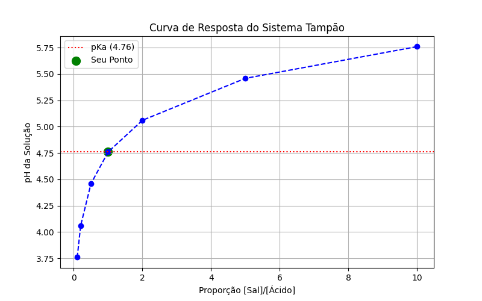
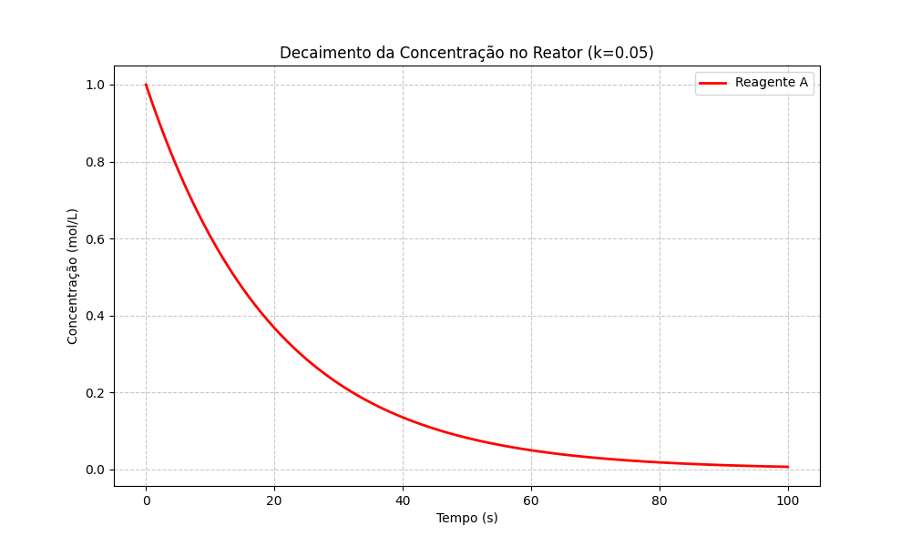
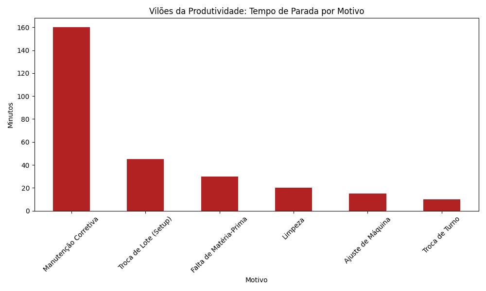

# Projetos-Engenharia_Bio-Python 
# 🚀 Engenharia, Química e Programação: Soluções em Python

Bem-vindo ao meu repositório de projetos técnicos! Aqui aplico algoritmos de *Engenharia de Computação* para resolver problemas reais nas áreas de *Bioquímica* e *Engenharia Química*.

## 🧬 Projeto 1: Analisador Genético (Bioinformática)
Script desenvolvido para simular o dogma central da biologia molecular. 
* *Funcionalidade:* Transcreve sequências de DNA em RNA e traduz códons em cadeias de aminoácidos (proteínas).
* *Destaque:* Utiliza estruturas de dicionário para mapeamento rápido do código genético.

## 🧪 Projeto 2: Calculadora de Equilíbrio Químico (pH de Tampão)
Ferramenta para automação de cálculos laboratoriais baseada na *Equação de Henderson-Hasselbalch*.
* *Funcionalidade:* Calcula o pH de soluções tampão a partir do pKa e das concentrações de sal/ácido.
* *Destaque:* Implementação de tratamento de exceções (erros de digitação e divisão por zero).

## 📊 Projeto 3: Monitor de Laboratório v1.0 (Data Science)
Este é o projeto mais avançado do portfólio, unindo automação e visualização de dados.
* *Funcionalidade:* Além de calcular o pH, o script gera automaticamente um gráfico da curva de titulação do sistema tampão.
* *Persistência de Dados:* Implementa um sistema de logs que salva cada análise em um arquivo técnico .txt com carimbo de data e hora.
* *Stack:* Python, Matplotlib (Plotagem) e Manipulação de Arquivos (I/O).
### 📈 Curva de Titulação Gerada:

*
## 🧪 Projeto 4: Simulador de Cinética Química (Reator Batelada)
Este projeto avança na modelagem matemática, saindo de cálculos estáticos para simulações dinâmicas de processos químicos ao longo do tempo.

* *Funcionalidade:* Simula o decaimento da concentração de um reagente em um reator de primeira ordem, utilizando a equação exponencial $C = C_0 \cdot e^{-kt}$.
* *Engenharia:* Permite que o usuário defina a concentração inicial, a constante de velocidade ($k$) e o tempo de operação, gerando a curva de consumo do reagente.
* *Destaque Técnico:* Uso de loops (for) para geração de séries temporais e aplicação de funções transcendentais da biblioteca math.
* *Visualização:* Gera um gráfico de decaimento cinético para análise de tempo de residência e conversão.
### 📈 Resultado Visual da Simulação:

## 📊 Projeto 5: Analisador de Dados de Sensores Industriais (Pandas)
Este projeto marca a transição para a Ciência de Dados aplicada à Indústria 4.0, utilizando a biblioteca Pandas para análise de grandes volumes de informações.

* *Funcionalidade:* Simula a leitura de um sensor de temperatura em regime 24h, calculando métricas críticas como temperatura média e picos de calor.
* *Segurança de Processos:* Implementa um sistema de alertas automáticos que identifica condições de superaquecimento fora dos limites operacionais.
* *Stack Técnica:* Pandas (DataFrames), Matplotlib (Monitoramento Térmico) e Lógica de Decisão Baseada em Dados.
* *Impacto:* Demonstra capacidade de automatizar a inspeção de logs industriais, reduzindo a necessidade de monitoramento manual.

### 📈 Gráfico de Monitoramento Térmico:

---
## 🖥️ Projeto 6: Engenharia Pro - Interface Gráfica (GUI)
Este projeto eleva as ferramentas de cálculo para o nível de software comercial, removendo a necessidade de interação via terminal.

* *Interface Moderna:* Desenvolvida com CustomTkinter, apresentando suporte a Dark Mode e design responsivo.
* *Acessibilidade:* Interface intuitiva com campos de entrada validados para evitar erros de digitação.
* *Arquitetura:* Aplicação de lógica funcional integrada a componentes de interface em tempo real.

### 🖼️ Interface do Software:
(./
)

## 🌐 Projeto 7: Dashboard Web de Engenharia (Streamlit)
O projeto final consolida todos os conhecimentos anteriores em uma plataforma Web completa e interativa.

* *Tecnologia:* Streamlit (Framework de Data Science para Web).
* *Funcionalidade:* Central de comando que reúne a Calculadora de Equilíbrio Químico e o Monitor de Sensores em um único ambiente.
* *Diferencial:* Interface responsiva que roda no navegador, permitindo simulações rápidas e visualização de dados dinâmica.
* *Impacto:* Ferramenta pronta para ser publicada (Cloud) e utilizada por equipes técnicas de forma remota.

### 🖼️ Dashboard em Operação:
/

## 📊 Projeto 8.A: Automação de Inteligência de Dados (Excel Industrial)

Este projeto demonstra a capacidade de integrar o Python com ferramentas corporativas (Excel) para automatizar o fluxo de relatórios de produção, eliminando processos manuais e erros humanos.

* *Contexto Industrial:* Simulação de uma base de dados de produção de granjas/unidades fabris.
* *Engenharia de Dados:* Implementação de cálculos automáticos de métricas de desempenho, como a *Eficiência de Conversão Alimentar (CA)*.
* *Tecnologias:* Uso da biblioteca Pandas para manipulação de dados e OpenPyXL para motor de escrita Excel.
* *Diferencial:* Geração de relatórios multi-abas, separando dados brutos de um *Resumo Executivo* formatado para tomada de decisão gerencial.

### 🖼️ Resultado da Automação:

## 🗄️ Projeto 8.B: Persistência de Dados com SQL (SQLite)

Nesta etapa, implementei a camada de banco de dados para garantir que as informações de qualidade e produção sejam armazenadas de forma estruturada e permanente.

* *Tecnologia:* SQLite (Banco de dados relacional leve e eficiente).
* *Estrutura:* Criação automatizada de tabelas via SQL (DDL) e inserção de dados via Python.
* *Foco em Qualidade:* Registro de status de lotes (Aprovado/Reprovado) com métricas de peso médio.
* *Impacto:* Transição do armazenamento em arquivos simples para um sistema de Gerenciamento de Banco de Dados (SGBD), permitindo consultas rápidas e histórico de longo prazo.

### 🖼️ Visualização do Banco de Dados no VS Code:

## 🤖 Projeto 9: Inteligência Artificial Preditiva (Machine Learning)

Neste projeto, implementei um modelo de aprendizado de máquina para automatizar a tomada de decisão no controle de qualidade.

* *Algoritmo:* RandomForestClassifier (Scikit-Learn).
* *Funcionalidade:* O modelo consome dados históricos do banco SQL e aprende a classificar lotes como "Aprovado" ou "Reprovado" com base no peso médio.
* *Processamento:* Realizei a limpeza e transformação de dados (Encoding), além da divisão entre conjuntos de treino e teste para validação da acurácia.
* *Resultado:* O modelo atingiu 100% de precisão nos dados de teste, sendo capaz de prever o status de novos lotes de forma instantânea.

## 🏆 Projeto 10: Sistema Integrado de Inteligência Industrial

O projeto final consolida todas as competências adquiridas, criando um ecossistema completo de processamento de dados.

* *Arquitetura:* O sistema realiza o pipeline completo: Coleta -> IA (Predição) -> SQL (Persistência) -> Excel (Reporting).
* *Automação Total:* Redução de intervenção humana na classificação de qualidade de produtos.
* *Visão de Engenharia:* Demonstração de um sistema ponta a ponta (End-to-End) focado em escalabilidade e confiabilidade de dados.

## 🏭 Projeto 11: Gestão de Eficiência Industrial (OEE & Downtime Analyser)

Este projeto foca na espinha dorsal da engenharia de produção: a maximização da produtividade através da análise de indicadores de performance (OEE).

* *O Problema:* Identificar onde a fábrica está perdendo dinheiro por inatividade e baixa performance.
* *A Solução:* Um sistema que processa o tempo de máquina parada por categoria e calcula o impacto financeiro real para a unidade.
* *Métricas Implementadas:*
    * *Disponibilidade:* Percentual de tempo em que a linha esteve apta a produzir.
    * *Performance:* Comparação entre o ritmo real e a capacidade nominal.
    * *Qualidade:* Índice de conformidade de produtos finais.
* *Análise de Pareto:* Geração automática de gráficos de barras que expõem os maiores "vilões" da produtividade (Ex: Manutenção Corretiva, Setups demorados).
* *Impacto Financeiro:* O código converte minutos parados em valores monetários (R$), facilitando a comunicação com a diretoria para investimentos em melhorias.

### 🖼️ Análise de Gargalos Operacionais:

> *Diferencial:* Este projeto demonstra visão de negócio, focando em redução de custos e maximização de lucros através de dados reais de engenharia.

## 🥛 Projeto 11.B: IA de Monitoramento Preditivo (Caso de Estudo: Yakult Lorena)

Este projeto simula um cenário real de alta cadência industrial, focado na planta da Yakult em Lorena/SP, com uma produção estimada em *2 milhões de unidades diárias*.

* *O Problema:* Em linhas de altíssima velocidade, pequenos desvios de ritmo podem gerar prejuízos de milhares de reais em poucos minutos. 
* *A Solução (IA):* Implementação do algoritmo *Isolation Forest* (Scikit-Learn) para detecção de anomalias em tempo real.
* *Funcionalidade:* O sistema monitora o "ritmo cardíaco" da linha de produção. Caso o fluxo de frascos por minuto saia do padrão ideal, a IA identifica o desvio imediatamente, antes que ocorra uma quebra total.
* *Métricas de Engenharia:* Cálculo automático de déficit de produção e identificação visual de pontos críticos (gargalos).

### 🖼️ Painel de Monitoramento:

> *Destaque:* Este sistema demonstra competência em *Indústria 4.0*, unindo estatística avançada e ciência de dados para garantir a continuidade operacional.

## 📦 Projeto 12: Otimização de Supply Chain (Ponto de Pedido Automático)

Este projeto resolve o problema de falta de insumos em linhas de produção de fluxo contínuo.

* *Conceito:* Implementação de lógica de *Ponto de Pedido (PP)* e *Estoque de Segurança*.
* *Funcionalidade:* O sistema analisa o consumo diário médio e o Lead Time (tempo de entrega) dos fornecedores para identificar riscos de ruptura de estoque.
* *Output Profissional:* Geração automática de requisições de compra em formato CSV para itens com status crítico.
* *Valor para a Indústria:* Redução de custos de armazenagem e eliminação de paradas de fábrica por falta de matéria-prima.

### 🎓 Sobre Mim
* *Formação:* Cursando o 3º ano de Engenharia de Computação (UNIVESP).
* *Conquista:* 3º lugar no Provão Paulista para o curso de *Bioquímica na USP* em 2023.
* *Objetivo:* Unir o poder da computação com processos industriais e biotecnológicos.

## 🛠️ Tecnologias
* Python 3.x
* Biblioteca Math
* Versionamento com Git/GitHub

* *Funcionalidade:* Simula o decaimento da concentração de um reagente em um reator de primeira ordem, utilizando a equação exponencial $C = C_0 \cdot e^{-kt}$.
* *Engenharia:* Permite que o usuário defina a concentração inicial, a constante de velocidade ($k$) e o tempo de operação, gerando a curva de consumo do reagente.
* *Destaque Técnico:* Uso de loops (for) para geração de séries temporais e aplicação de funções transcendentais da biblioteca math.
* *Visualização:* Gera um gráfico de decaimento cinético para análise de tempo de residência e conversão.
